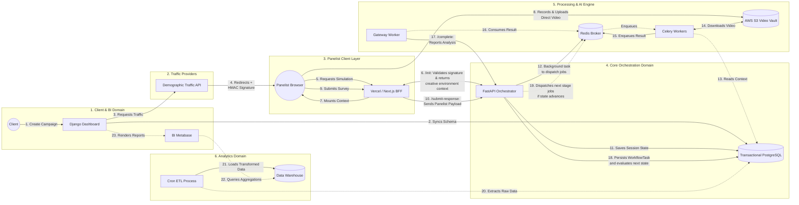
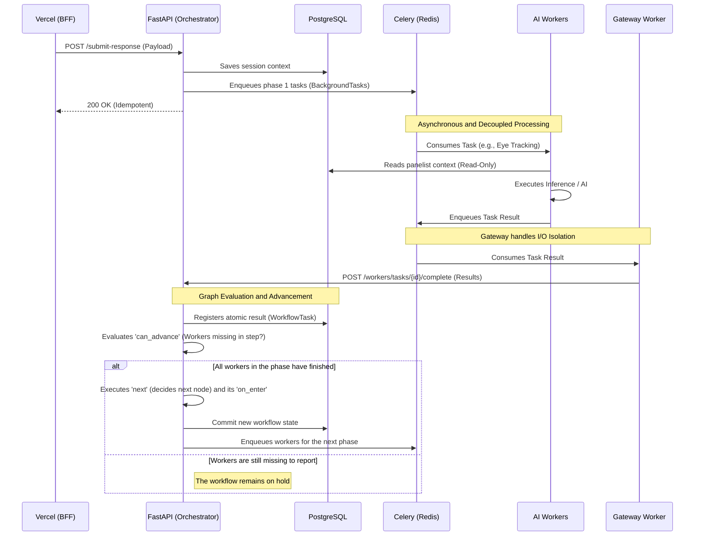

# Domain-Agnostic Workflow Engine: High-Concurrency Orchestrator (FastAPI + Celery/Redis V1)

This document details the architecture of a custom graph-based orchestration engine. It is designed to manage asynchronous data lifecycles, coordinate background AI workers, and handle state transitions under high concurrency.

*Note: The core source code is proprietary. This repository serves as a technical whitepaper demonstrating the engine's internal mechanics and its implementation in a real-world scenario.*

The V1 architecture is built on **FastAPI, Celery, Redis, and PostgreSQL**:
* **Redis** operates as a lightweight in-memory message broker, bypassing the operational overhead of deploying complex event-streaming clusters (e.g., Kafka) during early-stage rollouts.
* **PostgreSQL** serves as the strict transactional state store. While the engine's relational mapping is database-agnostic (capable of running on MySQL), PostgreSQL is utilized here to guarantee ACID compliance, persist the state machine's progression, and manage concurrent worker callbacks securely before the consolidated data is finally extracted to an analytical Data Warehouse.

The modular boundaries of this implementation are explicitly designed to pave the way for an eventual migration to a fully decoupled event-driven model.

🔗 **[View the V2 Event-Driven Architecture (Kafka + ClickHouse) Document Here](./README.md)**

---

### 💼 Contact
If you need to solve concurrency issues or complex workflows, feel free to contact me to discuss how this framework can be adapted to your use case:
*   **LinkedIn:** https://www.linkedin.com/in/david-camba/
*   **Email:** davidcamba@msn.com

---

## 1. The Core Engine: Agnostic Declarative State Machine (FastAPI)

At its core, this framework acts as a highly resilient, stateful orchestrator built on **FastAPI**. It replaces complex conditional branch logic with an elegant, graph-based declarative execution model. 

In this engine, any business process is mapped as a state graph where the workflow transitions through defined nodes. The orchestrator evaluates the system's progress using three structural primitives:
*   **`on_enter`**: Isolated, transactional side effects or actions executed immediately upon entering a node (e.g., dispatching tasks to message brokers).
*   **`can_advance`**: Boolean checks and safety assertions that determine whether the active state can be cleared (e.g., verifying if all required callbacks or workers for the current phase have reported execution success).
*   **`next`**: Dynamic routing rules that compute the next state node in the graph, enabling conditional branching and logical routing based on execution outputs.

### Native Framework Architectural Patterns

To handle massive concurrent operations without transactional degradation, the engine embeds three native architectural patterns:

#### A. Deferred Publishing to Celery/Redis (Preventing Race Conditions)
A common pitfall in asynchronous systems is publishing tasks to a message queue before the database transaction has committed. If a worker picks up the job immediately, it might attempt to read a state that does not yet exist in PostgreSQL. 
*   **The Framework Solution:** The engine leverages FastAPI's native `BackgroundTasks` lifecycle. Tasks destined for Celery/Redis are registered in-memory during execution and are physically published *only after* the database transaction commits successfully.

#### B. Preventing Lost Updates (Write Isolation / MVCC Pattern)
When multiple workers process asynchronous tasks concurrently, they often finish and report back at the exact same millisecond. Modifying a shared JSON column or updating a single state row in parallel causes database row locks or "lost update" write collisions.
*   **The Framework Solution:** Instead of mutating a central workflow state column, the engine uses an append-only relational model. Each worker's execution is registered as an independent atomic record in a `WorkflowTask` database table. The engine aggregates these distinct tasks dynamically to verify completion, eliminating row-level write contention.

#### C. Claim-Check Pattern (Low-Memory Messaging)
Routing heavy payloads (such as large JSON matrices, base64 data, or raw telemetry tensors) directly through Redis/Celery message queues causes memory bloat and chokes the message broker.
*   **The Framework Solution:** The engine enforces a strict "Claim-Check" pattern. Job payloads dispatched to the message broker contain only lightweight pointer references (e.g., `workflow_id`, `task_id`). Workers use these pointers to query the necessary heavy context directly from PostgreSQL or persistent storage, keeping broker memory usage predictable and fast.

---

## 2. Practical Use Case: Biometric Market Research Pipeline

This project implements the declarative engine in a high-concurrency business scenario: a **Biometric Market Research Platform**.

### The Business Context: In-Context Ad Testing & Emotion AI
The platform evaluates advertising campaigns by simulating digital environments and capturing user interactions:
1. **Simulation:** Users ("panelists") are routed to the platform where they interact with a simulated social media feed (e.g., an Instagram or TikTok clone) containing specific brand advertisements. 
2. **Biometric Capture:** During the interaction, webcams record facial telemetry and gaze data.
3. **Surveying:** Immediately after the simulation, panelists complete a questionnaire regarding the campaign.
4. **AI Correlation:** The system processes the video streams to extract biometric data (attention vectors, emotional states). It then correlates these physical reactions with the survey answers to evaluate the ad's performance.

### The Engineering Challenge: Temporal Dependencies & Dynamic Routing
Processing concurrent video streams for biometric analysis requires asynchronous execution and resolving strict **temporal dependencies** between AI models:
1. **Phase 1 (Ingestion & Fraud):** The system processes demographic metadata and runs fraud heuristics to flag bots.
2. **Phase 2 (Biometrics):** Validated sessions advance to the compute phase. An *Eye Tracking* computer vision model extracts focal vectors, while a concurrent *Emotion Analysis* model maps facial keypoints.
3. **Phase 3 (Consolidation):** A *Scoring Engine* correlates the biometric time-series data with the survey answers.

Additionally, business logic requires **dynamic routing**. For example, "Premium" campaigns require full multi-model biometric analysis, while "Standard" campaigns bypass video processing to execute only survey ingestion and fraud detection. The declarative state graph orchestrates these conditional branches and background tasks without blocking the main web servers.

```mermaid
graph LR
    Start((Start)) --> INITIAL_STEP[INITIAL_STEP]

    INITIAL_STEP -->|Next| S_FRAUD

    subgraph S_FRAUD [STEP_PANELIST_DATA_SAVED]
        direction TB
        w1(fraud_analyzer)
    end

    S_FRAUD -->|evaluate_fraud_step: Detected| S_FRAUD_DET[STEP_FRAUD_DETECTED]
    S_FRAUD -->|evaluate_fraud_step: Valid| S_FRAUD_NOT_DET[STEP_FRAUD_NOT_DETECTED]

    S_FRAUD_DET -->|fraud_provider_claim| TERMINATION_STEP((TERMINATION_STEP))

    S_FRAUD_NOT_DET -->|pay_provider_and_advance| S_BIO

    subgraph S_BIO [STEP_BIOMETRICS]
        direction TB
        w2(emotion_worker)
        w3(eye_tracking_worker)
    end

    S_BIO -->|Tasks Completed| S_ANA

    subgraph S_ANA [STEP_ANALYSIS]
        direction TB
        w4(final_scoring_worker)
        w5(data_consolidation_worker)
    end

    S_ANA -->|Tasks Completed| S_DWH

    subgraph S_DWH [STEP_READY_FOR_DWH]
        direction TB
        w6(delete_biometric_video)
    end

    S_DWH --> TERMINATION_STEP
```

### The Architecture: High-Concurrency Interaction Flow
To operate this pipeline, the API exposes a dedicated endpoint layer secured with internal API keys for communication between the presentation layer (BFF on Vercel), the Orchestrator, and the background systems:
* `/bff-gateway/workflows/init`: Fetches campaign allocations and active benchmarks.
* `/bff-gateway/workflows/submit-response`: Receives the raw survey telemetry and begins execution.
* `/workers/tasks/{task_id}/complete`: Collects completion callbacks from our asynchronous background workers.

### Detailed Execution Cycle
1. **Ingestion & Encryption Validation:** The panelist lands on Vercel. Vercel requests session initialization from the Orchestrator `/init`, which validates the cryptographic HMAC signature to prevent traffic spoofing.
2. **Telemetry Collection:** The user interacts with the simulation. When finished, the browser uploads the video directly to S3 via an Orchestrator-generated S3 presigned URL. The survey answers are posted to Vercel and forwarded to `/submit-response`.
3. **The Asynchronous Pipeline (Gateway Worker Pattern):**
   Heavy AI inference (e.g., Sentiment analysis, CV) requires expensive GPU/CPU nodes. To maximize efficiency, AI workers must never wait on network I/O or HTTP retries.
   The AI worker pulls a job from Redis, reads context from PostgreSQL (read-only), processes the models, and publishes the results back to a Redis result queue.
   A lightweight, I/O-bound Gateway Worker consumes these results and handles the HTTP POST call to the Orchestrator's `/workers/tasks/{id}/complete` endpoint, absorbing network latency, backoffs, and retries.
4. **State Consolidation & Automated Cron ETL:** As workers report back, the engine executes state evaluations. Once all nodes reach the terminal state, a final worker removes the biometric video from S3 for data privacy compliance.
   An independent external Cron ETL process periodically extracts completed transactions from PostgreSQL and loads structured aggregations into the Data Warehouse (DWH) for visualization.

## 3. Implementation-Specific Architecture Trade-offs

* **Deferred Commit & Unit of Work (Router-Level Transaction Management):**
  Services involved in execution (`WorkflowService`, `AllocationService`) never issue a database `commit()`. All mutations are buffered in memory and persisted strictly at the router level when the HTTP request lifecycle successfully terminates. This guarantees transactional atomicity across operations.
* **Database Coupling (Shared DB Pattern with Django):**
  We accept an intentional database coupling at the table level (`Campaign`, `CampaignCreative`) with the Django administration dashboard. While a strict microservices approach would separate these databases and synchronize them via an Event Bus, the operational overhead did not justify duplicating schemas for this early stage. Django remains the owner of these configurations, and FastAPI reads them as-is.
* **S3 Critical Path Protection (Fast-Fail Pattern):**
  Video upload generation is part of the critical path. If S3 or connection pools experience transient errors, the orchestrator does not trigger long backoffs; it fails fast to protect system availability, allowing the client-side app to implement local retries.
* **Pragmatic Broker Selection (Redis vs. Dedicated Message Queues):**
  While tools like RabbitMQ or Apache Kafka offer superior routing and event-replay guarantees, Redis was selected alongside Celery for this V1 iteration. The trade-off exchanges complex persistence guarantees for speed of deployment and a lower infrastructure footprint, fitting a pragmatic lifecycle while paving the way for an eventual Kafka migration.

## 4. Database Schema Design

The relational Postgres schema is designed to separate campaign structures from dynamic, high-volume execution states:
* **Campaign (`Campaign`):** Defines global study parameters. Includes a JSONB column `purchased_features` listing client-purchased features (e.g., `eye_tracking`, `sentiment_analysis`). The graph engine parses this column to dynamically append or prune the queue of upsell workers for any execution.
* **Creative (`CampaignCreative`):** Represents the simulation configuration.
  * `platform`: Identifies the social platform being simulated (Instagram, Netflix, etc.), allowing multi-platform A/B testing.
  * `target_count` & `assigned_count`: Control quotas. The allocation service mathematically prioritizes creatives with the lowest fill ratio to ensure uniform distribution of impressions.
  * `is_control_group`: Segregates a percentage of traffic as a baseline.
* **Workflow State (`PanelistWorkflow`):** The primary execution tracker. It records the current active step in the graph and the unique session token validating the panelist's trajectory.
* **Tasks (`WorkflowTask`):** Holds individual outputs generated by background workers, detailing the worker identifier, completion status, and computed data payload.

## 5. Evolution: Event-Driven Architecture (Kafka + ClickHouse V2)

To transition this architecture from a synchronous gateway-broker pattern to a near-infinite scaling event-driven environment, the V2 architecture replaces Celery with Apache Kafka. This design utilizes CQRS and Event Sourcing to eliminate transactional database bottlenecks:
1. **Ingestion Gateway:** A lightweight, stateless API endpoint that receives raw panelist payloads, immediately publishes them to a `raw-payloads` Kafka topic, and returns a fast HTTP `202 Accepted`.
2. **State Projection:** A dedicated microservice consumes the raw topics, materializes the transactional database representation, and publishes a highly consistent `PayloadPersisted` integration event.
3. **Event Orchestration (Choreography):** The Graph Orchestrator reacts to `PayloadPersisted` events, evaluating the state transition and publishing command topics (e.g., `run-eye-tracking`) to Kafka.
4. **Decoupled Worker Ecosystem:** Workers subscribe to specific command topics. Since the system is decoupled via Kafka, if a worker fails or scales, messages are buffered safely on the partitions without impacting the web servers.
5. **Streaming ETL:** Kafka Connect feeds database modifications directly from PostgreSQL to a ClickHouse analytical data warehouse, enabling real-time dashboards without querying transactional databases.

🔗 **[View the complete V2 Event-Driven Architecture (Kafka + ClickHouse) Document Here](./README.md)**

---

*For architectural reviews, consultation requests, or detailed design inquiries, refer to the contact details at the top of this document.*