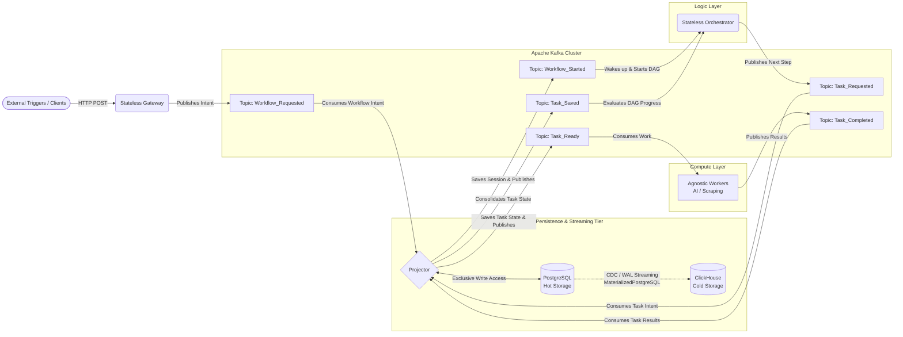
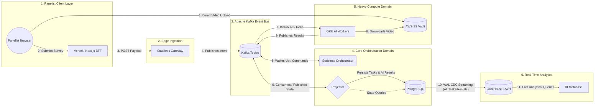
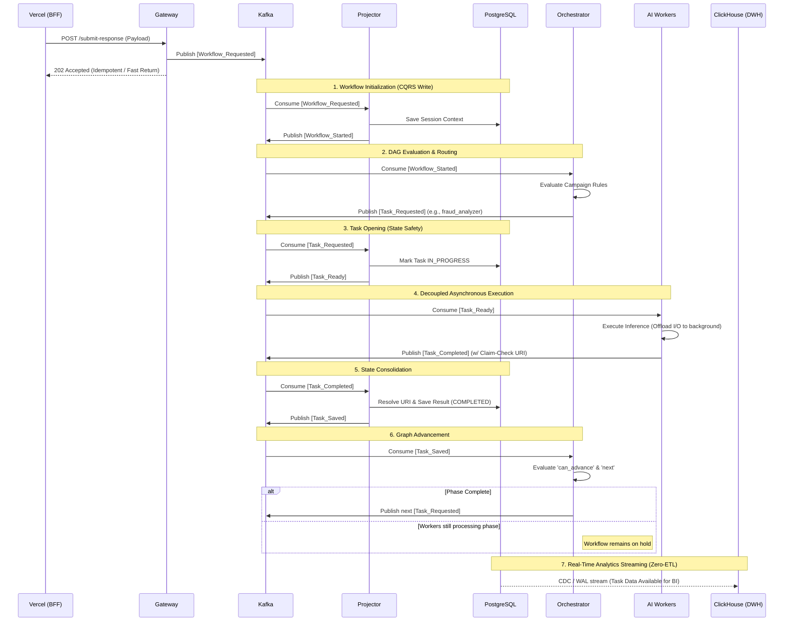

# Domain-Agnostic Workflow Engine: High-Concurrency Orchestrator (Kafka + ClickHouse)

This document details the architecture of a custom graph-based orchestration engine. It is designed to manage asynchronous data lifecycles, coordinate background AI workers, and handle state transitions under high concurrency.

By leveraging **Apache Kafka** and **ClickHouse**, this architecture is specifically engineered to absorb massive ingestion spikes, orchestrate stateless AI processing at scale, and provide real-time analytical streaming with zero transactional degradation.

*Note: The core source code is proprietary. This repository serves as a technical whitepaper demonstrating the engine's internal mechanics and its implementation in a real-world scenario.*

🔗 **[Looking for an MVP setup? View the infrastructure-light Architecture (FastAPI + Celery/Redis) Document Here](./README-mvp.md)**

---

### 💼 Contact
If you need to solve concurrency issues or complex workflows, feel free to contact me to discuss how this framework can be adapted to your use case:
*   **LinkedIn:** https://www.linkedin.com/in/david-camba/
*   **Email:** davidcamba@msn.com

---

## PART I: THE FRAMEWORK (Agnostic Architecture)

### 1. The Core Engine: Agnostic Declarative State Machine

At its core, this framework acts as a highly resilient, stateful orchestrator. It replaces complex conditional branch logic with an elegant, graph-based declarative execution model. 

In this engine, any business process is mapped as a state graph where the workflow transitions through defined nodes. The orchestrator evaluates the system's progress using three structural primitives:
*   **`on_enter`**: Isolated, transactional side effects or actions executed immediately upon entering a node (e.g., dispatching commands to the event bus).
*   **`can_advance`**: Boolean checks and safety assertions that determine whether the active state can be cleared (e.g., verifying if all required callbacks or workers for the current phase have reported execution success).
*   **`next`**: Dynamic routing rules that compute the next state node in the graph, enabling conditional branching and logical routing based on execution outputs.

### 2. Event-Driven Infrastructure: Distributed Topology

In a massive-scale pipeline, coupling ingestion, state management, and task delegation within a single processing layer creates severe database lock contention and connection pooling bottlenecks. To achieve near-infinite scalability, this framework is natively designed around highly specialized, decoupled components communicating exclusively via Kafka.

#### 2.1. Distributed Component Architecture

*   **Stateless Gateway (The Edge):** A purely stateless, lightweight API layer. Its sole responsibility is authenticating external requests, wrapping payloads, and publishing workflow initiation intentions (`Workflow_Requested`) directly to Kafka. It never connects to the transactional database, acting as a massive shock-absorber.
*   **The Projector (CQRS & State Guardian):** The most critical piece for data integrity. It is the *only* component with `INSERT/UPDATE` permissions to the PostgreSQL database. It consumes intentions from Kafka, safely persists them (creating sessions or marking tasks as `IN_PROGRESS`), and publishes confirmation events. It also acts as a *Watchdog*, actively polling for stuck tasks to republish them (Self-Healing).
*   **Stateless Orchestrator (The Brain):** A reactive, stateless engine that interprets the declarative DAG. It listens for `Workflow_Started` events to initialize a campaign's logic and `Task_Saved` events to evaluate progress. Based on the rules, it publishes `Task_Requested` commands to trigger the exact workers needed next.
*   **Agnostic Workers (The Muscle):** Stateless, specialized execution nodes (AI inference, scraping, etc.). They listen for `Task_Ready` events, execute their internal logic (often offloading heavy I/O to background threads), and publish `Task_Completed` without knowing the global state of the workflow.

#### 2.2. The Agnostic Topology

The following diagram illustrates the generalized framework topology, completely independent of the business domain. It highlights the separation of concerns between ingestion, state tracking, distributed execution, and real-time streaming analytics.

#### 2.3. The Event Topology (Workflow & Task Lifecycles)

To maintain strict separation of concerns (CQRS) and isolate business logic from pure execution, the event bus is divided into two distinct families: **Workflow Events** and **Task Events**. The Projector remains the **only** component with write permissions to PostgreSQL to prevent lock contention.

**Family 1: Workflow Initialization (Session Start)**
*   **`Workflow_Requested` (Intention):** The Gateway receives the payload from the client/panelist and requests the initiation of a session.
*   **`Workflow_Started` (Official Session):** The Projector has persisted the initial state of the workflow/session in PostgreSQL.

**Family 2: Task Lifecycle (The DAG Execution)**
*   **`Task_Requested` (Task Intent):** The Orchestrator evaluates the business logic and requests the execution of a specific task (e.g., *fraud_analyzer* or *eye_tracking*).
*   **`Task_Ready` (Commitment):** The Projector has saved the task as `IN_PROGRESS` in the database. Workers can now safely consume it.
*   **`Task_Completed` (Raw Result):** The Worker has finished processing and emits its raw result (or an S3/Redis URI via the Claim-Check pattern).
*   **`Task_Saved` (Consolidation):** The Projector has resolved the Claim-Check, downloaded any necessary external payloads, and saved the final result in PostgreSQL as `COMPLETED`.

---

## 3. Native Architectural Patterns & Data Tiering

To handle massive concurrent operations, heavy AI payloads, and real-time analytics without degrading transactional throughput, the framework implements three core engineering patterns.

### 3.1. CQRS & The Reconciliation Loop (Self-Healing)

*   **Write Isolation (CQRS):** If hundreds of AI worker containers attempted to update their status directly in PostgreSQL simultaneously, the system would collapse under connection exhaustion and MVCC row locks. By enforcing CQRS, the **Projector** is the exclusive writer. It consumes Kafka events and executes updates sequentially or in micro-batches, protecting the database layer.
*   **The Watchdog (Reconciliation):** Distributed networks are inherently unreliable; worker containers might crash or suffer out-of-memory errors mid-execution. The Projector runs a continuous background process (Watchdog) that polls PostgreSQL for tasks stuck in `IN_PROGRESS` beyond a defined timeout. If detected, it assumes worker failure and safely republishes the task to the `Task_Ready` topic, ensuring fully automated **Self-Healing**.

### 3.2. Claim-Check Pattern & Async I/O (FinOps Optimization)

Event brokers like Kafka are not designed to transport large payloads (e.g., 100MB video tensors or massive scraped JSON arrays). 
*   **Avoiding Fat Events:** The system uses the **Claim-Check Pattern**. When a worker generates a heavy result, it uploads the actual payload to a fast cache (Redis) or persistent storage (AWS S3). The event published to `Task_Completed` only contains lightweight metadata and the storage URI. The Projector later uses this URI to download and consolidate the data.
*   **Asynchronous I/O Offloading:** GPU instances for AI inference are extremely expensive. Blocking the main GPU processing thread while waiting for a 100MB file to upload over the network is a massive waste of resources. The framework's worker SDK offloads the S3 upload to a background thread (`asyncio` / ThreadPool). The worker immediately frees the GPU and returns to pulling the next message from Kafka, maximizing compute utilization (FinOps).

### 3.3. Zero-ETL Streaming & Data Tiering

Analytical queries (aggregations, BI dashboards) and transactional state changes have diametrically opposed database requirements. Instead of running heavy, delayed Cron ETL jobs to move data, the architecture relies on native streaming.

*   **Hot Storage (PostgreSQL):** Acts strictly as the transactional state engine. To maintain millisecond index lookups, an automated pruning process routinely deletes session data older than a defined threshold (e.g., 14 days).
*   **Cold Storage (ClickHouse):** Acts as the immutable, columnar data warehouse for Analytics and Data Science. 
*   **CDC (Change Data Capture):** Data flows from Postgres to ClickHouse in real-time via `MaterializedPostgreSQL`. ClickHouse natively connects to the PostgreSQL Logical Replication Slot and reads the Write-Ahead Log (WAL). Every transaction the Projector commits is replicated to ClickHouse in milliseconds, with zero CPU impact on the transactional database and no custom ETL code to maintain.

---

## PART II: THE APPLICATION (Real-World Scenario)

## 4. Practical Use Case: Biometric Market Research Pipeline

This project implements the declarative engine in a high-concurrency business scenario: a **Biometric Market Research Platform**.

### 4.1. The Business Context: In-Context Ad Testing & Emotion AI
The platform evaluates advertising campaigns by simulating digital environments and capturing user interactions:
1. **Simulation:** Users ("panelists") are routed to the platform where they interact with a simulated social media feed (e.g., an Instagram or TikTok clone) containing specific brand advertisements. 
2. **Biometric Capture:** During the interaction, webcams record facial telemetry and gaze data.
3. **Surveying:** Immediately after the simulation, panelists complete a questionnaire regarding the campaign.
4. **AI Correlation:** The system processes the video streams to extract biometric data (attention vectors, emotional states). It then correlates these physical reactions with the survey answers to evaluate the ad's performance.

### 4.2. Assumptions and Context (The Domain)

The design of this architecture is based on the following premises:

1.  **Integration with Panelist Providers:** Providers like Dynata or Cint expose an API through which we can publish and request traffic for our campaigns. These providers redirect panelists to our domain (Vercel) attaching key parameters in the URL: `provider`, `campaign_id`, `panelist_id`, demographic data, and a cryptographic signature (**HMAC**).
2.  **Security and Backend for Frontend (BFF):** The Next.js application on Vercel acts as an intermediary (via Server Actions / API Routes). Vercel simply receives the request and forwards it to the Orchestrator. **It is the Orchestrator that validates the HMAC signature**, determining the legitimacy of the session. Vercel is unaware of the validation logic, acting purely as a presentation layer.
3.  **Decoupling Video Storage:** To avoid saturation and bottlenecks in the backend, uploading video files does not pass through the application servers. The end client (the web browser) uploads the resource directly to a storage bucket (AWS S3) using presigned URLs securely generated by the Orchestrator.

### 4.3. The Engineering Challenge: Temporal Dependencies & Dynamic Routing
Processing concurrent video streams for biometric analysis requires asynchronous execution and resolving strict **temporal dependencies** between AI models:
1. **Phase 1 (Ingestion & Fraud):** The system processes demographic metadata and runs fraud heuristics to flag bots.
2. **Phase 2 (Biometrics):** Validated sessions advance to the compute phase. An *Eye Tracking* computer vision model extracts focal vectors, while a concurrent *Emotion Analysis* model maps facial keypoints.
3. **Phase 3 (Consolidation):** A *Scoring Engine* correlates the biometric time-series data with the survey answers.

Additionally, business logic requires **dynamic routing**. For example, "Premium" campaigns require full multi-model biometric analysis, while "Standard" campaigns bypass video processing to execute only survey ingestion and fraud detection. The declarative state graph orchestrates these conditional branches and background tasks natively.

```mermaid
graph LR
    Start((Start)) --> INITIAL_STEP[INITIAL_STEP]

    INITIAL_STEP -->|Next| S_FRAUD

    subgraph S_FRAUD [STEP_PANELIST_DATA_SAVED]
        direction TB
        w1(fraud_analyzer)
    end

    S_FRAUD -->|evaluate_fraud_step: Detected| S_FRAUD_DET[STEP_FRAUD_DETECTED]
    S_FRAUD -->|evaluate_fraud_step: Valid| S_FRAUD_NOT_DET[STEP_FRAUD_NOT_DETECTED]

    S_FRAUD_DET -->|fraud_provider_claim| TERMINATION_STEP((TERMINATION_STEP))

    S_FRAUD_NOT_DET -->|pay_provider_and_advance| S_BIO

    subgraph S_BIO [STEP_BIOMETRICS]
        direction TB
        w2(emotion_worker)
        w3(eye_tracking_worker)
    end

    S_BIO -->|Tasks Completed| S_ANA

    subgraph S_ANA [STEP_ANALYSIS]
        direction TB
        w4(final_scoring_worker)
        w5(data_consolidation_worker)
    end

    S_ANA -->|Tasks Completed| S_CLN

    subgraph S_CLN [STEP_CLEANUP]
        direction TB
        w6(delete_biometric_video)
    end

    S_CLN --> TERMINATION_STEP
```

### 4.4. High-Concurrency Interaction Flow (Ecosystem Topology)

To operate this pipeline safely across thousands of concurrent panelists, the architecture segregates responsibilities into distinct infrastructure domains. 

*   The **Edge Domain** absorbs the HTTP traffic and converts it into events.
*   The **Core Orchestration Domain** processes the events, with the Projector guarding the database and the Orchestrator evaluating the DAG.
*   The **Heavy Compute Domain** executes the AI models, strictly using AWS S3 for massive video file transfers (Claim-Check) to keep the Event Bus lightweight.
*   The **Analytics Domain** automatically receives structured data in real-time via CDC.

### 4.5. Detailed Execution Cycle (Event Sequence)

The following sequence diagram demonstrates how a single panelist's submission flows through the decoupled architecture. It highlights the strict boundaries between ingestion, state persistence (Projector), logical routing (Orchestrator), and processing (Workers).

## 5. Implementation-Specific Architecture Trade-offs

* **Database Coupling (Shared DB Pattern with Django):**
  We accept an intentional database coupling at the table level (`Campaign`, `CampaignCreative`) with the legacy Django administration dashboard. While a strict microservices approach would isolate these configurations and synchronize them via an Event Bus, the operational overhead does not justify duplicating schemas. Django remains the owner of these configurations, and the Projector/Orchestrator read them as-is.
* **S3 Critical Path Protection (Fast-Fail Pattern):**
  Video upload generation (presigned URLs) is part of the critical path. If S3 or connection pools experience transient errors during initialization, the gateway does not trigger long backoffs; it fails fast to protect system availability, allowing the client-side app to implement local retries.

## 6. Vision V3: The Future Orchestration Framework

While the current architecture provides a highly resilient infrastructure, defining the business flow and worker contracts still requires manual configuration. The V3 vision evolves the platform from a component-based infrastructure into a unified **Python Library / Internal Framework** focused heavily on Developer Experience (DX).

### 6.1. Abstracting Infrastructure via Decorators
In V3, developers creating new AI models or Scrapers will not write a single line of code related to Kafka, PostgreSQL, or AWS S3. The Library will provide standard decorators (e.g., `@wayops_task`) that encapsulate all infrastructural complexities. 

*   **Declarative Workers:** A developer simply writes pure Python business logic (e.g., processing a matrix). The decorator automatically handles subscribing to the correct `Task_Ready` Kafka topic, deserializing the payload, and executing the function.
*   **Automated Claim-Check & Async I/O:** If the worker returns a heavy payload (like a 100MB tensor), the Library intercepts the return object, automatically spawns a background thread to upload it to S3, and publishes the lightweight URI to `Task_Completed`—all completely invisible to the worker's source code.

### 6.2. Static Graph Validation (Fail-Fast)
The biggest risk in a distributed async DAG is logical contract errors (e.g., *Worker C* requires data from *Worker B*, but *Worker B* was logically bypassed in a specific campaign route). 

With the framework acting as a cohesive Library, workers will use typed contracts to declare their required inputs and generated outputs. When the Orchestrator boots up, it will perform a complete matrix evaluation of the DAG. If it detects a path where a required dependency might not be produced, the system will execute a **Crash on Boot** (Fail-Fast). This shifts logical pipeline bugs from runtime (production) to compile-time (CI/CD), mathematically guaranteeing data alignment before a single user interaction occurs.

